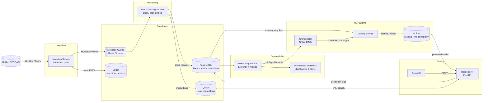

# Naysayer

*· Course: MLOps · Date: July 2026*
*Template based on [eugeneyan/ml-design-docs](https://github.com/eugeneyan/ml-design-docs)*

---

## 1. Overview

Large open-source repositories receive dozens to hundreds of new issues per day. Triaging them — applying labels and spotting duplicates — is manual, slow, and inconsistent. This project builds a **GitHub Issue Assistant**: a service that, given a newly opened issue, (a) suggests labels via a multi-label text classification model and (b) surfaces likely duplicate issues via embedding similarity search. The system continuously ingests new issues from selected public repositories, uses maintainer-applied labels as delayed ground truth, monitors model quality and data drift, and retrains on a schedule or when performance degrades.

## 2. Motivation

Issue triage is a real, unsolved pain point for open-source maintainers: mislabeled issues delay routing to the right contributors, and duplicate issues fragment discussion and waste maintainer time. The problem is well suited to an MLOps course project because:

- Data is **free, abundant, and continuously updating** (GitHub REST API).
- Ground truth arrives naturally but with a delay (maintainers label issues days/weeks after opening), which creates a genuine feedback loop for monitoring and retraining.
- Concept drift is real: label taxonomies evolve, new components/features generate new vocabulary, and issue-writing style changes over time.

## 3. Success metrics

- ≥ 70% of new issues receive at least one correct label suggestion (top-3 suggestions vs. labels eventually applied by maintainers).
- For issues later closed as duplicates, the true duplicate appears in the top-5 similar-issue suggestions ≥ 50% of the time.
- Hypothetical maintainer time saved: measured as the fraction of issues where suggestions could have been accepted as-is.

## 4. Requirements & Constraints

**Functional requirements:**
- The system ingests new and updated issues from 1–3 configured public repositories at least daily. (Will start with 1)
- Given an issue (title + body), the API returns: top-k suggested labels with confidence scores, and top-k most similar existing issues with similarity scores.
- The system compares predictions against maintainer-applied labels once they become available and computes rolling quality metrics.
- The system detects data/performance drift and can trigger retraining.

**Non-functional requirements / constraints:**
- Cost: ~$0/month — free GitHub API tier (5,000 requests/hour authenticated), local or free-tier infrastructure, small models trainable on CPU or a free Colab GPU.
- Complexity budget: one trained model + one training-free retrieval component.
- Performance: p95 inference latency < 500 ms; batch ingestion for a day of issues completes < 15 min.
- All components containerized and reproducible via `docker compose up`.

### 4.1 In-scope & out-of-scope

**In scope:** label suggestion model, duplicate retrieval, automated ingestion, offline evaluation, monitoring, trigger-based retraining, REST inference API, minimal demo UI.

**Out of scope:** priority prediction (no reliable ground truth in most repos), assignee recommendation (sparse, imbalanced, privacy-adjacent), automatic write-back of labels to GitHub (suggestions only), multi-language issues (English-only filter), comment-thread analysis.

Doubt it lol

## 5. Methodology

### 5.1 Problem statement

Two sub-problems:

1. **Label suggestion — supervised multi-label text classification.** Input: issue title + body (text). Output: probability per label from the repository's label taxonomy (restricted to the ~15–30 most frequent labels per repo, e.g. `bug`, `feature-request`, `documentation`, `area/networking`). Framed as one-vs-rest classification over a fixed label set per repository.
2. **Duplicate detection — retrieval, not classification.** Input: issue text. Output: k nearest neighbors from the corpus of existing open/closed issues by embedding cosine similarity. No model training required; evaluated against issues explicitly closed as duplicates (GitHub "duplicate of #X" references / `duplicate` label).

### 5.2 Data

**Sources:** GitHub REST API (`GET /repos/{owner}/{repo}/issues`, `.../events`, `.../timeline`) for 2–3 large, actively maintained repositories (candidates: `kubernetes/kubernetes`, `microsoft/vscode`, `grafana/grafana`) — each has tens of thousands of historical labeled issues and 30–150 new issues per day.

**Training data:** historical issues (title, body, created_at, state) with maintainer-applied labels as targets. Initial bootstrap: ~30–50k issues per repo via paginated API backfill.

**Serving input:** title + body of a single issue.

**Data updates:** incremental daily pull of issues created/updated since the last sync (using the `since` parameter). Label changes on existing issues are captured too — this is how delayed ground truth flows in.

**Storage:** raw API responses (JSON) in object storage (MinIO, S3-compatible) as an immutable bronze layer; cleaned/normalized records in PostgreSQL (silver); training-ready feature snapshots versioned per training run (gold). Embeddings stored in a vector database (Qdrant).

### 5.3 Techniques (preprocessing & modeling)

**Preprocessing (high level):**
- Strip markdown artifacts, code blocks (replace with `<CODE>` token), URLs, issue templates boilerplate, and bot-generated issues.
- Filter: English-only (langdetect), minimum body length, exclude pull requests (the API mixes them in).
- Label cleaning: keep labels with ≥ N training examples (e.g., N=100); map renamed labels via a small alias table.
- Deduplicate exact reposts; train/validation/test split **by time** (train on older issues, validate on newer) to mimic production and expose drift.

**Models:**
- **Baseline:** TF-IDF (word + char n-grams) → One-vs-Rest Logistic Regression. Fast, CPU-only, strong baseline for issue text.
- **Candidate:** fine-tuned DistilBERT (or a frozen sentence-transformer + linear heads) if the baseline is insufficient.
- **Duplicate retrieval:** `sentence-transformers/all-MiniLM-L6-v2` embeddings + cosine similarity in Qdrant. No training; only index maintenance.

Honestly still not sure, we'll see during implementation

### 5.4 Experimentation & Validation

**Offline evaluation:** time-based holdout (last 2 months of issues). Metrics:
- Label model: micro-F1 and macro-F1 (macro guards against ignoring rare labels), precision@3 and recall@3 (matches the "suggest top-3" product framing), per-label PR curves for threshold tuning.
- Duplicate retrieval: recall@5 and MRR on the set of issues closed as duplicates with a known target issue.

**Online (continuous) evaluation:** for every prediction logged at issue-open time, join with labels the maintainers actually applied within 14 days; compute rolling weekly precision@3/recall@3. This is the primary production quality signal.

**Model comparison — champion–challenger scheme:** every training run is logged to MLflow (params, data snapshot ID, metrics) and registered as the **challenger**. An evaluation step compares champion vs. challenger on the same fixed holdout; the challenger is promoted to **champion** (and picked up by the Inference API) only if it improves micro-F1/precision@3 by a defined margin, otherwise the current champion keeps serving.

### 5.5 Human-in-the-loop

The system only *suggests* and a human (maintainer, or me in the demo UI) accepts or rejects. Accept/reject actions are logged as additional feedback. A manual block label list excludes labels that should never be auto-suggested. Promotion of a retrained model to production requires one-click human approval in the demo setup.

## 6. Implementation

### 6.1 High-level design (architecture diagram)

**Data flow summary:** the Ingestion Service polls GitHub and drops raw events onto a queue and into object storage → Preprocessing consumes the queue, writes clean records to Postgres and embeddings to Qdrant → the Orchestrator periodically snapshots training data and runs the Training Service, which logs to MLflow → the Inference API loads the promoted model from the registry and serves predictions, logging them to Postgres → the Monitoring Service joins predictions with delayed ground-truth labels, computes drift/quality metrics, and can trigger retraining via the Orchestrator.

### 6.2 Microservices decomposition

| # | Service | Role & functionality | Communication |
|---|---------|----------------------|---------------|
| 1 | **Ingestion Service** | Polls GitHub API on schedule; handles pagination, rate limits, incremental sync (`since`); writes raw JSON to MinIO; publishes issue events to the queue. | Outbound HTTPS to GitHub; produces to Redis Streams; writes to MinIO. |
| 2 | **Preprocessing Service** | Consumes issue events; cleans/normalizes text; filters PRs, bots, non-English; upserts records into Postgres; computes and upserts embeddings into Qdrant. | Consumes Redis Streams; SQL to Postgres; gRPC/HTTP to Qdrant. |
| 3 | **Training Service** | On trigger, builds a versioned training snapshot from Postgres, trains the label model, evaluates on holdout, logs everything to MLflow, registers the candidate as **challenger**. | Invoked by Airflow; SQL read; MLflow tracking API. |
| 4 | **Model Registry (MLflow)** | Stores experiments, metrics, artifacts (persisted to MinIO); holds `champion`/`challenger` aliases; single source of truth for which model serves. | REST API consumed by Training Service and Inference API. |
| 5 | **Inference API (FastAPI)** | `POST /predict` → top-k labels + confidences; `POST /similar` → top-k duplicate candidates; `GET /health`, `GET /metrics`. Loads production model at startup and on registry webhook/poll. Logs every prediction. | REST (JSON) to clients; SQL writes; Qdrant queries; Prometheus scrape endpoint. |
| 6 | **Monitoring Service** | Nightly job: joins predictions with maintainer labels (14-day window) → rolling precision@3/recall@3; Evidently reports for input drift (text length, vocabulary, embedding distribution) and prediction drift; fires retraining trigger and alerts when thresholds breach. | SQL reads; triggers retraining DAG via Airflow REST API; pushes metrics to Prometheus. |
| 7 | **Orchestrator (Airflow)** | Schedules ingestion (hourly/daily), monitoring (nightly), retraining (weekly + on drift trigger); retries and failure notifications. | Invokes services via their entrypoints/APIs. |
| 8 | **Demo UI**  | Paste an issue or pick a live one → see suggested labels and similar issues; accept/reject buttons for feedback logging. | REST to Inference API. |

**Communication patterns:** synchronous **REST** for request/response paths (UI → API, services → MLflow); asynchronous **message queue** (Redis Streams — lightweight, no extra broker to operate) for the ingestion → preprocessing pipeline, giving buffering and replay; **scheduled orchestration** (Airflow) for batch workflows. All services share nothing except the databases/registry — each is an independent Docker container.

### 6.3 Operational requirements per service

| Service | Scalability | Performance | Reliability |
|---|---|---|---|
| Ingestion | Single instance sufficient (rate-limited by GitHub anyway); horizontal by repo if needed. | Full daily sync < 15 min; respects 5,000 req/h limit with backoff. | Idempotent upserts; checkpointed `since` cursor → safe to re-run. |
| Preprocessing | Horizontally scalable consumers (consumer group on the stream). | ≥ 50 issues/s cleaning; embedding ≥ 10 issues/s on CPU. | At-least-once processing; dedup by issue ID. |
| Training | Vertical (single job); GPU optional. | Baseline retrain < 15 min on CPU; DistilBERT < 2 h on free GPU. | Fully reproducible from data snapshot + logged params. |
| Inference API | Stateless → horizontal via replicas behind a reverse proxy. | p95 < 500 ms; ≥ 20 RPS on a laptop-class machine. | Health checks; model loaded read-only; graceful fallback to previous model on load failure. |
| Monitoring | Single nightly batch job. | Nightly run < 10 min. | Missed run alert; metrics are recomputable (derived from Postgres). |
| Orchestrator / Registry / DBs | Single-node for the course; volumes backed up. | n/a | Docker volumes + nightly `pg_dump`. |

### 6.4 Infra

Local-first: the data layer, Airflow, MLflow, and serving run via **Docker Compose** on a laptop or a single small VM. The **model pipeline (processing → training → tuning → evaluation → registration)** is assembled on a **Databricks Free Edition** (free, bundles managed MLflow and job pipelines, the local MLflow is then replaced by the Databricks-hosted one), fallback **Kubeflow Pipelines on a local kind/minikube cluster**. Serving stays local/containerized either way; the Inference API pulls the champion model from the registry. The model service is made scalable by running it as **N stateless replicas behind an nginx reverse proxy** (`docker compose up --scale api=3`).

May change, first time working with this stuff.

### 6.5 Security

Inference API protected by a static API key header (sufficient for a course project), services communicate on an internal Docker network — only the API and UI are exposed.
May be later enhanced.

### 6.6 Data privacy

All data is already public (public GitHub issues). Still: no scraping of user emails, no assignee-level modeling (avoids profiling individuals), and the dataset can be deleted on request per GitHub's terms. GDPR exposure is minimal since no private personal data is stored.

### 6.7 Monitoring & Alarms

- **System metrics:** request rate, latency, error rate per service (Prometheus + Grafana), queue lag, ingestion success/failure.
- **Data metrics:** daily issue volume per repo, share filtered out, embedding drift score, label distribution shift (Evidently).
- **Model metrics:** rolling precision@3 / recall@3 vs. delayed ground truth, confidence distribution shift.
- **Alarms:** ingestion failed (> 24 h), rolling precision@3 drops > 10% below the level at deployment, drift score above threshold → auto-trigger retraining flow + notification (e.g., Telegram/Slack webhook).

### 6.8 Cost

≈ $0/month: free GitHub API, open-source stack, local compute. Optional: one small cloud VM (~$5–10/month) for an always-on demo.

### 6.9 Integration points

Upstream: GitHub REST API (only external dependency, mitigated by raw-data archiving so backfills never re-hit old pages unnecessarily). Downstream: demo UI and (out of scope, future) a GitHub App that posts suggestions as issue comments.

### 6.10 Risks & Uncertainties

- **Label noise:** maintainers label inconsistently, mitigated by restricting to frequent labels and macro-F1 tracking.
- **Class imbalance:** some labels are rare; mitigated by per-label thresholds and reporting macro metrics.
- **Duplicate ground truth is sparse:** few issues are formally marked duplicates → small eval set; mitigated by pooling across repos and reporting confidence intervals.
- **GitHub API changes / rate-limit tightening:** mitigated by archived raw data and configurable poll frequency.
- **Outscope mentioned problems**

## 7. Appendix

### 7.1 Alternatives considered

- **Priority & assignee prediction (original 4-task idea):** rejected — no reliable priority ground truth in public repos, assignee data is sparse and profiles individuals. Kept as future work.
- **News classification:** viable and simpler, but not useful to me, at least with this one I can play around when I have time (no delayed ground truth also).
- **LLM-based labeling (zero-shot via API):** rejected as the core approach — the course requires training/retraining a model, and API costs are nonzero, so yeah, still may be used as an offline comparison baseline.
- **Kafka instead of Redis Streams:** rejected — operational overhead not justified at this scale.
- **SageMaker instead of Databricks for the managed pipeline:** viable, but has no meaningful free tier for repeated training jobs; Databricks Free Edition keeps the project at ~$0.

### 7.2 Milestones & timeline

**Week 1 — Assignment 2: baseline model, API, and data pipeline**

- Ingestion Service (GitHub API client, pagination, rate-limit handling, `since`-based incremental sync); one-shot historical backfill of **1 repo** (pick one with a clean, frequent label taxonomy, e.g. `microsoft/vscode`) into MinIO (raw JSON) + PostgreSQL (clean records). Two repos is a stretch goal, not a requirement for week 1.
- Minimal preprocessing (strip markdown/code blocks, filter PRs and bots, keep top-N labels, time-based train/holdout split).
- **Airflow DAG** — single scheduled job that pulls new/updated issues daily and appends them to the training dataset in storage. This satisfies the "put new data into storage" requirement without needing the full streaming/queue layer yet.
- Baseline model — TF-IDF + One-vs-Rest Logistic Regression; quick offline eval (micro/macro-F1, precision@3).
- FastAPI wrapper (`/predict`, `/health`) around the model, Dockerized.
- *Deliverables:* working Airflow ingestion DAG, populated storage, containerized baseline API.

**Week 2 — Assignment 3: experiment tracking + scalable serving + champion–challenger**

- Stand up MLflow (tracking server + artifact store pointed at MinIO); refactor the Week 1 training script to log params/metrics/artifacts to MLflow on every run.
- Model Registry with `champion`/`challenger` aliases; a small evaluation script that scores challenger vs. champion on the fixed holdout and promotes on improvement — this is the whole "champion-challenger scheme," no need to over-engineer it as a separate microservice yet.
- Make the model service scalable — run the FastAPI container as N replicas behind nginx (`docker compose up --scale api=3`); quick locust smoke test to confirm it holds up.
- Buffer / polish — write up what changed, fix anything broken from scaling out.
- *Deliverables:* MLflow tracking with artifacts in object storage, champion–challenger promotion script, horizontally scaled model service.
- *Cut if short on time:* duplicate-detection (Qdrant) feature — nice-to-have, first thing to drop.

**Weeks 3 — Assignment 4: full pipeline on a managed platform + demo**

- Stand up the managed pipeline environment — **Databricks Free Edition** (fastest to get running, free, and its managed MLflow lets Week 2's tracking carry over almost unchanged). Kubeflow-on-kind only if Databricks access is a problem.
- Port the pipeline steps as Databricks jobs/notebooks: data gathering (trigger from the Airflow DAG or re-implemented as a Databricks job — whichever is less duplicated effort) → processing → training → registration → metric logging → champion-vs-challenger evaluation. Skip hyperparameter tuning unless everything else is done early — it's explicitly optional in the assignment.
- Wire evaluation to automatically pick and serve the best model (the registry alias flip from Week 2 already does most of this work — just point it at the Databricks-hosted registry).
- End-to-end dry run on fresh live issues; fix integration gaps between Airflow/local services and the Databricks pipeline.
- Prepare and rehearse the short presentation/demo (architecture recap, live prediction call, forced retrain-and-promote walkthrough).
- *Deliverables:* end-to-end gather → process → train → (tune, optional) → register → evaluate → serve pipeline running on Databricks/Kubeflow, plus final presentation/demo.

### 7.3 Tools & technologies (summary)

Python · FastAPI · scikit-learn (baseline) / Hugging Face Transformers (candidate) · sentence-transformers · Optuna (tuning) · PostgreSQL · MinIO · Qdrant · Redis Streams · Apache Airflow · MLflow · Databricks Free Edition· Evidently · Prometheus + Grafana · nginx (load balancing API replicas) · locust (load testing) · Docker Compose · GitHub Actions (CI: lint, tests, image build) · pytest.

### 7.4 References

- Eugene Yan — *How to Write Design Docs for Machine Learning Systems* (template source).
- GitHub REST API docs — Issues, Timeline events, rate limits.
- Evidently AI docs — text data drift detection.